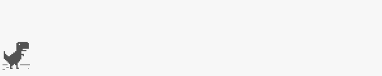

# T-Rex

Replicate of the T-Rex game of Google, in TypeScript.

# extraction.html

The [extraction.html](./extraction.html) is a **stand-alone** HTML file (only 105KB) running T-Rex!

All assets (mp3/png) are encoded into the HTML, which means that only the HTML file is needed to play T-Rex!

All codes and assets are extracted from [source code of Chromium](https://cs.chromium.org/chromium/src/components/neterror/?q=t-rex+package:%5Echromium$&dr=C) which is released under [BSD](http://www.linfo.org/bsdlicense.html).

**All rights of this file are reserved by Chromium Team.**

# Updates

Version | Update
---|---
0.0.1 | T-Rex with blinking eye
0.1.0 | Translated to TypeScript