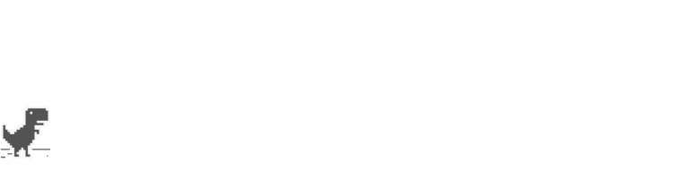

# Instructions

The goal of this experiment is to customize the Google Chrome T-Rex Game according to the tasks below.

## Tasks

Information before starting:
- You will have up to **45min** time to work on these three tasks. 
- Complete the tasks in chronological order (i.e., task 1, task 2, task 3).
- Do not skip tasks before completing them.
- Do not resize or move the windows during the experiment.
- You might need to reload the game preview after making changes.

You are allowed to use:

✅ All IDE functionality that is enabled (including code suggestions).  
✅ Web Searches, Documentations, StackOverflow etc.

You are **not allowed** to use the following:

❌ Do not use external generative AI tools (e.g., ChatGPT)  
❌ Do not use CoPilot Chat

Finally: Do not worry if you can not complete all tasks! Good luck 😀

---

### Task 1: Speed Control

Implement the ability to increase and decrease the speed of the t-rex by using the left and right arrows ← →.

Definitions of Done:

- You can increase the speed of the t-rex by pressing the right arrow (→) and decrease the speed by pressing the left arrow (←).

Hints:
- You can find and add the key press definitions in [/src/runner.ts (L106)](/src/runner.ts#L106)
- Do not confuse the `KEYDOWN` event and `onKeyDown` function with pressing the down arrow key ↓. It **does not** refer to the down arrow key, but to the event of any key being pressed down!

---

### Task 2: Life System

Implement a system where the T-Rex has three lives, allowing it to continue after hitting obstacles as long as there is at least one life left. Display the life counter as a number next to the distance meter (top right corner).

Definitions of Done:

- Game starts with 3 lives, displaying the counter in the top-right corner.
- After a collision with an obstacle deduct 1 life.
- Show the GameOver screen, if no lives (i.e., 0 lives) remain.
- _Hint: After a collision, you might need to set a grace period or move the obstacle, such that the player does not get hit again instantly in the next frame_

---

### Task 3: Share Achievement

In the GameOver screen, implement the option to share your current run as an image. Add a share button next to the “Start Again” button, which will ask the user to enter a name, and then trigger the download of the image. The image should contain the user name, achieved distance, and use the last frame as the background image:

Definitions of Done:

- Add a _Share_ button next to the _Restart_ button in the GameOver screen.
- By clicking the _Share_ button, the user is prompted to enter a name.
- After submitting the name, a download of the sharable image is triggered. The image should contain the user name, achieved distance, and use the last frame as the background image.
