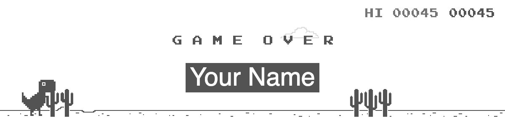

# Task 3: Customize Sharing Achievement

Currently, a share button appears below the game canvas after the game is over. By clicking the button, the current HTML canvas gets downloaded as an image. Customize this share function, such that users can add their name to the image, before downloading it. Most if not all changes can directly be made in the [SharePanel](./src/sharePanel.ts) component.

Definitions of Done:

- By clicking the _Share_ button, the user is prompted to enter a name.
- After submitting the name, a download of the sharable image is triggered. The image should contain the user name, achieved distance, and use the last frame as the background image.

The final image could look like this:

 
 

---

 
 

**[> <ins>Finished task 3? Click here for the final questionnaire</ins> <](#)**